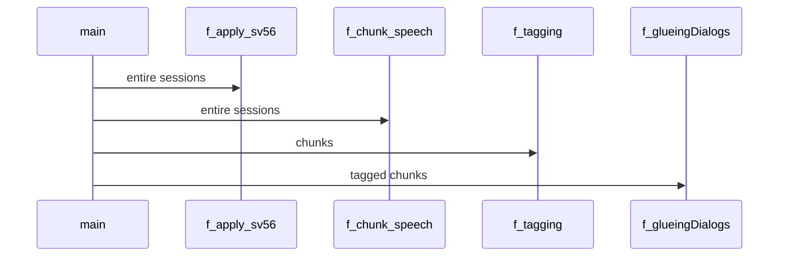

# Segmenting and Tagging Speech Recording Sessions

## Overview

We conducted 300 speech recording sessions in 2016/2017 at the [Quality and Usability Lab](http://www.qu.tu-berlin.de/menue/qu/) of the Technische Universität Berlin for the collection of the [Nautilus Speaker Characterization (NSC) Corpus](http://www.qu.tu-berlin.de/?id=nsc-corpus). Long, continuous wavfiles of approx. 40 minutes were aquired from each of the microphones employed. We then used this tool to sort out the speech that corresponded to each dialog. In other words, we assigned utterances to the different parts of the database design.

This repository contains Matlab scripts for:
* segmenting speech recording sessions (partition speech into sentences, based on detected silences),
* tagging speaker turns (assign a tag to each of the speech segments, e.g. dialog 1a, emotional speech, questions,...).

For details on the purpose of employing these scripts, see Section 2 of the [NSC Documentation](http://www.qu.tu-berlin.de/fileadmin/fg41/users/fernandez.laura/NSC_documentation_v01.pdf).

**No audio** or means to recover the speech recording sessions are provided in this repository. Speakers names are pseudo anonymized.

## Steps

From main.m, all the following steps are run for each speech recording session:

#### 0. Preparation

* sets paths - paths pointing to folders with .wav, .mat, .m, files or to final compiled database.

* load 'segmenting.mat' - keep track of what steps have been done for each speaker. We need to take into account that each speech recording session corresponds to a different speaker, and there were 300 speakers in total. There are three different microphones used in each recording session.

* load 'tagscommands.csv' - commands used by the annotator to indicate the given tag in the "Tagging" step.

#### 1. Normalizing level

* The speech from the whole recording sessions is level-equalized to -26dB, using the voltmeter algorithm of ITU-T Rec. P.56. 

#### 2. Segmenting / Chunking

* Call the function 'f_chunk_speech' to create .mat files with the information of segmented recording sessions, needed for the next steps. The This function is based on a initial script written by Lars 

#### 3. Tagging

#### 4. Glueing

## Organization of scripts

This diagram shows the sequential realization of the mentioned steps.

## Folder structure

#### all_exported
Original .wav files from the recording sessions. In the case of NSC data, these were exported from Cubase 4, the software used to record the speech. There is a speech file for each microphone and speaker. Some speakers were recorded with only one microphone - this is taken into account in segmenting.mat.

#### all_exported_sv56

Level-equalized .wav files, originated after the "Normalizing level" step.

#### chunked

Chunked speech, stored in .mat files, each of them with a struct with the fields: audio (audio samples in each snippet), wavpos (for each snippet), tags (for each snippet), Fs, wavfilename, pseudonym, speakerID, gender, nsnippets, comments.

#### input

Contains 'segmenting.mat' and 'tagscommands.csv' needed for step 0: "Preparation", and 'IDs_pseudonyms.mat' with the mappings of speaker IDs and pseudonyms.

#### matlab

Matlab scripts that perform the steps mentioned above.

#### NSC_root
Final database files generated (.wav), after the "Glueing" step, are stored here. The files are allocated in the 'headsetmic', 'standmic', or 'tablemic' folders depending on the microphone with which the speech was acquired.

## TODO
This tool can be improved for other speech databases:
* Include scripts to refine dialogs by selecting the most natural realizations (not done for NSC corpus)